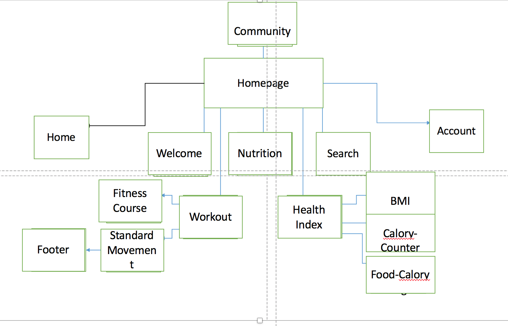
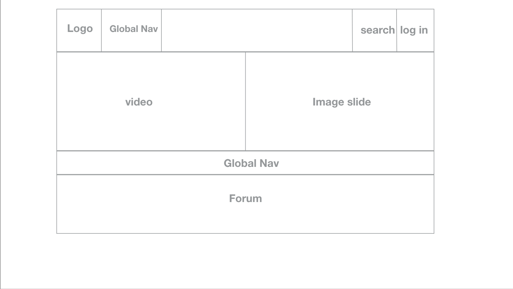
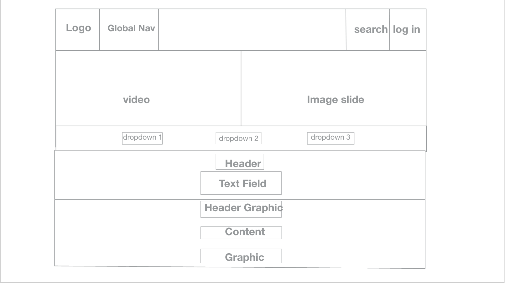
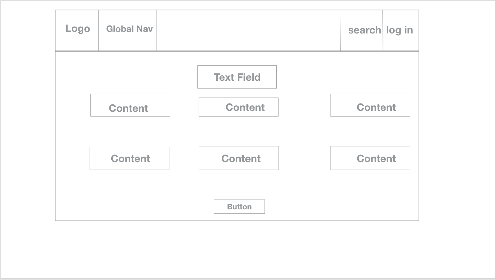

# MSTU 5003 Design Document (Template)

Write a design document where you explain your project. You should clearly explain the problem you're trying to solve. Be sure to describe the domain you're working with and the users you're trying to target. Remember that the point of your design document is that you can hand it off to any developer and theoretically they would be able to understand and build the program.

## Topic
This website works as a personal dietitian and body trainer for our user. It is going to create an interactive and responsive environment for users to learn nutrition and healthy knowledge which could be used to improve users' personal health condition .

## Problem
Based on common sense, losing weight and control our diet are pretty hard, I want to make it an interesting experience. From my personal experience, I don't want to spend time checking food calory of each type, because it is time-consuming and impractical. Second, even though I know clear the nutrition and calory of each type of food, I'm  still confused about how to mix diet reasonably and healthily. If I want to lose weight, I have to consume more calory through energy expenditure than dietary intake. But how can I know how much calory I take in and how much I consume? If I want to strengthen my muscle, I cannot lose my calory too much, so I need to eat healthily and take in enough protein. Without an personal trainer, who can teach me how to workout and how to eat?
This website is created for the above concerns.
Firstly, the user could fill his/her own personal profile as a record and check his/her present health condition. This personal profile can also help us to gather data of our users. After using the website, the user can use health index to recheck if their health condition improves or not.
Secondly, there is a comprehensive archive of food calory information accessible to users. They can learn from this archive and be more expert in nutrition. Besides basic information, this site works as a personal trainer who can not only teach you how to workout but also provide healthy diet set for you based on calory intake and consumption. So, user can mix their diet based on their need.
Thirdly, the site will respond to user's choice and give specific guidance, not through cliché and dull text-version answer, but through vivid pictures that simulates real workout  experience. For example, our user can select the part they want to exercise, and the corresponding muscle structure will pop up.
Fourthly, this site aims to make learning nutrition and keeping feet easy and relaxing. So, instead of providing the users a huge bunches of text-version books, this site has the most accessible, valuable resources stored for them. The comprehensive but most commonly-used resources are provided both in language and images. Therefore, our users are not easily to be confused and frustrated.
Last but not least, this site aims to create a harmonious community. It is like a club where people who want to keep fit and live healthily are gathered together, sharing their life stories, learning resources, making friends and supporting others, and so on. This interaction will deepen mutual trust and positive feedback which brings satisfactory result.

## Target Audience
My target user is female (of course I don't refuse male users), who want to live healthy and keep fit. These group of people want to find a community to share their feeling, healthy tips, make friends and become prettier. They are positive and hold hope towards life. They take care of their life carefully and they are willing to spend time improving themselves physically and spiritually. Some of them are beginners for nutrition and exercise, and some are busy in day time, and some are fitness fanatic. All of them have the same goal that is to live a healthy life and become more beautiful. They might fail in losing weight or strengthening muscle for lack of related information or perseverance. They go to gym sometimes but they don't have a personal trainer, so nobody is there for further assistance or guidance. So they turn to this site to find their personal dietitian and body trainer.

### User Stories
**Outline 2-3 user stories. Describe how they find out, engage and come back to your site. Provide rationale.**

1.	My name is Mary. I’m 16 years old. I'm a senior high school student. I'm underweighted. My doctor told me it is directly related to poor diet and lack of physical activity. My parents are busy so they don't have too much time taking care of me. Most of time I cook by myself or just grab some fast food outside. My school work is a lot so I don't have time to workout. But I want to look prettier and healthier. I hope somebody could help me and teach me how to do.

2.	My name is Alice. I'm 25 years old. I'm a website developer. I'm quite busy and I spend a lot of time sitting and seldom doing exercise. I want to do some indoor activities but I don't know how. I want to control my weight and become thinner. But I couldn't control myself. Since I eat a lot and barely exercise, I'm afraid it is hard for me to lose weight. I really want to eat less and workout more. I hope I could have a guidance or partner with me.
3.	My name is Olivia. I'm 30 years old. I go to gym regularly, probably three times a week. But I don't have my personal trainer because that costs a lot. I have great passion on exercise, but I have difficulty strengthening muscle. Some friends told me I should combine exercising with reasonable diet. So, I guess I need advice from a dietitian.

## Strategy

This section should describe objectives, goals and metrics.

### Site Objectives:
*I want to make the site user friendly for the users to easily achieve their objectives; I want to improve the visual design and content structure so that users will enjoy their online experience; I want to make it easy, usable platform to convey the most important information; I want to make it easy for users to navigate to every section of the site; I want to add multimedia elements and make the learning experience interesting and effective; I want to improve user satisfaction through better service.

### Success Metrics
*Outline how you will check that the goals for your site have been met*
1. The number of unique people that visited my site per week(This will tell how many different people visit the site during a specific timeframe).  2. The number of people who registered a personal account in my site(This number will tell if users user the site for real learning or just for a visit). 3. The number of repeat visitors(If this number is growing, this means that people are visiting my site once and then deciding to come back again).4.where did these people come from (This information will tell you how to forge a relationship for advertising).5. View the top page report(It will tell me what pages my visitors think are the most important on my site).6. The keywords that people type in a search engine(This will tell what people are really looking for). 7.Measure assessment and comments.

Make sure your program does something to measure the consider assessments as a part of your program. Here are a couple.

* Pre assessments: The website invites users to input their personal information and check their present health condition.
* Formative assessments: After using the website and follow instructions, users can use our health index tool, like BMI to check if their health condition improves or not.

## Scope
I'm creating a fitness site. Compared with other ways of keeping fit, exercising and eating healthy, I want to add multimedia elements in to this online website. The most important thing is to provide the users the core information and resources that they need to master as basic knowledge. I want to complete my site before June 5th, and with maximum 1000$ budget. My target users will be female who want to live a healthy life and become prettier. Because my site is about fitness, I will provide the most basic knowledge of nutrition, workout and some health index.I want to make the users a supportive community so that they can have discussion and sharing. The user can register their user account and store the information that meets their need. My site will impress people with its features of vividness, brightness,informativeness and conciseness.  
There will be at least 5 pages in total. On the home page, there should be clear navigation bar, sign up area, a video  and a welcoming image click on which users can enter sign-in page. I want images change in different pages, but the basic structure can pertain on all pages. Social media is a big market plan, so I want to include multimedia in my site. If it's something used often, provide links to all items you'd like to link to and they will be placed at the top if used a lot or bottom if not needing to be in main line of vision.
## Structure
Interaction design and information architecture

## Skeleton
Interface, navigation, information design

